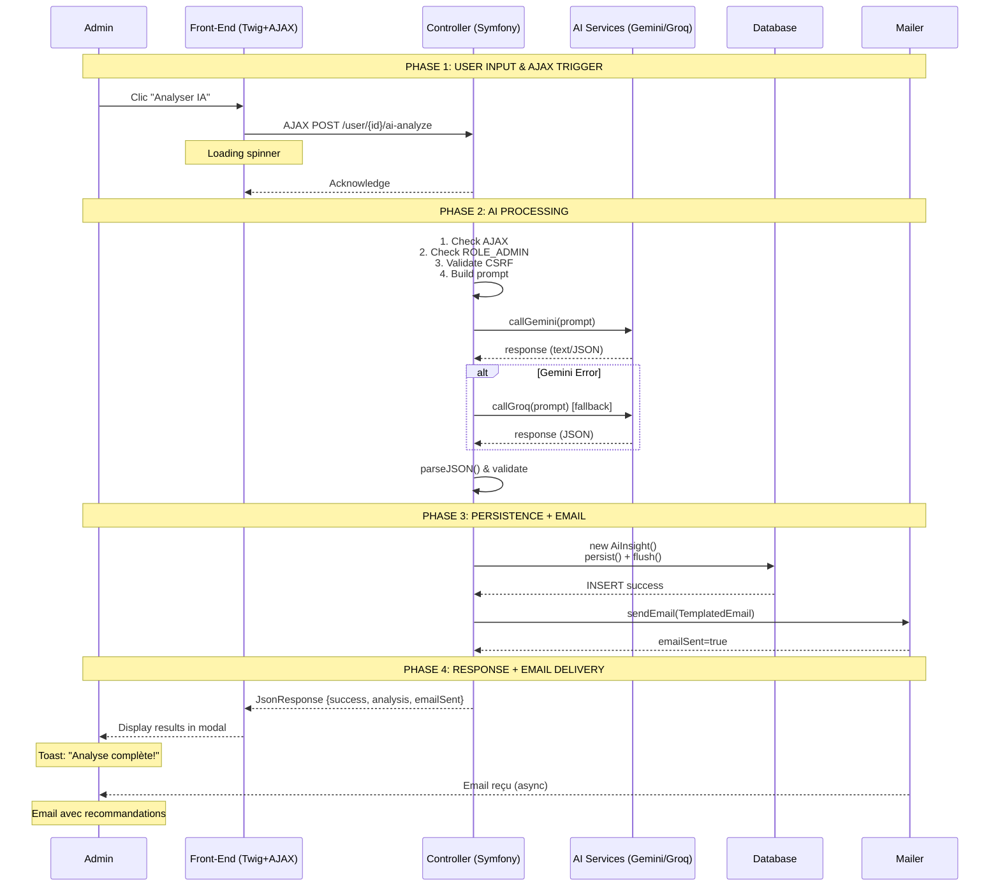

# PARTIE 3 — ACCEPTANCE CRITERIA (CA)

## CA-001: Contrôle d'Accès & Autorisations

**ID:** CA-001  
**Titre:** Accès sécurisé aux fonctionnalités User  
**Priorité:** Critique (Blocking)

### Critères

| # | Critère | Statut | Vérification |
|---|---------|--------|--------------|
| CA-001.1 | Seul `ROLE_ADMIN` peut accéder à `/admin/users` | ✅ | Test HTTP 403 si non authentifié |
| CA-001.2 | Seul `ROLE_ADMIN` peut créer/modifier/supprimer un utilisateur | ✅ | Test sur chaque route POST |
| CA-001.3 | Un admin ne peut pas se désactiver lui-même | ✅ | Vérification ID user === currentUser |
| CA-001.4 | Un admin ne peut pas se supprimer lui-même | ✅ | Vérification avant `$em->remove()` |
| CA-001.5 | Si un admin modifie son rôle et perd `ROLE_ADMIN`, il est déconnecté | ✅ | Redirect `/app_logout` |
| CA-001.6 | Token CSRF requis pour toutes les actions POST | ✅ | Validation `isCsrfTokenValid()` |
| CA-001.7 | Les utilisateurs inactifs ne peuvent pas se connecter | ✅ | Vérification au login |

---

## CA-002: Validation des Données

**ID:** CA-002  
**Titre:** Validation serveur stricte des données User  
**Priorité:** Critique

### Critères

| # | Critère | Statut | Contrainte Symfony |
|---|---------|--------|-------------------|
| CA-002.1 | Email est obligatoire et valide | ✅ | `@Assert\NotBlank`, `@Assert\Email` |
| CA-002.2 | Email est unique dans la base | ✅ | `@Assert\UniqueEntity(fields={"email"})` |
| CA-002.3 | Email max 180 caractères | ✅ | `@Assert\Length(max=180)` |
| CA-002.4 | Nom et Prénom obligatoires | ✅ | `@Assert\NotBlank` |
| CA-002.5 | Nom et Prénom max 100 caractères | ✅ | `@Assert\Length(max=100)` |
| CA-002.6 | Mot de passe min 8 caractères | ✅ | `@Assert\Length(min=8)` |
| CA-002.7 | Rôle: user, coach, ou admin | ✅ | `@Assert\Choice` |
| CA-002.8 | Téléphone valide si renseigné | ✅ | `@Assert\Regex` |
| CA-002.9 | Âge positif et < 150 | ✅ | `@Assert\Positive`, `@Assert\LessThan(150)` |
| CA-002.10 | Photo URL valide si renseignée | ✅ | `@Assert\Url` |
| CA-002.11 | `isActive` boolean obligatoire | ✅ | `@Assert\NotNull` |
| CA-002.12 | `createdAt` auto-généré | ✅ | `$user->setCreatedAt(new \DateTime())` |

---

## CA-003: Génération IA & Fallback

**ID:** CA-003  
**Titre:** Analyse IA avec Gemini primary + Groq fallback  
**Priorité:** Haute

### Critères

| # | Critère | Statut | Vérification |
|---|---------|--------|--------------|
| CA-003.1 | Gemini 2.5 Flash appelé en premier | ✅ | Log service |
| CA-003.2 | Si Gemini échoue, Groq est appelé | ✅ | Détection erreur string |
| CA-003.3 | Groq Llama-3.3-70b utilisé en fallback | ✅ | Appel service Groq |
| CA-003.4 | Réponse IA est JSON valide | ✅ | `json_decode()` |
| CA-003.5 | Réponse contient toutes les clés requises | ✅ | Vérification keys |
| CA-003.6 | `sentiment_score` entre 0 et 100 | ✅ | Validation range |
| CA-003.7 | `engagement_prediction` ∈ {faible, moyen, élevé} | ✅ | `in_array()` |
| CA-003.8 | `risk_level` ∈ {low, medium, high} | ✅ | Validation stricte |
| CA-003.9 | Si les deux IA échouent, erreur HTTP 500 | ✅ | Retour JsonResponse |
| CA-003.10 | Prompt inclut toutes les données user | ✅ | Vérification sprintf |

---

## CA-004: Persistance & Intégrité des Données

**ID:** CA-004  
**Titre:** Sauvegarde robuste en base de données  
**Priorité:** Critique

### Critères

| # | Critère | Statut | Vérification |
|---|---------|--------|--------------|
| CA-004.1 | Utilisateur persisté avec tous ses champs | ✅ | `$em->persist()` + `flush()` |
| CA-004.2 | Mot de passe hashé avant persistance | ✅ | `$passwordHasher->hashPassword()` |
| CA-004.3 | `createdAt` défini automatiquement | ✅ | Non modifiable edit |
| CA-004.4 | AiInsight créé et lié à l'user | ✅ | `$insight->setUser($user)` |
| CA-004.5 | AiInsight.analysis_data contient JSON | ✅ | Colonne JSON |
| CA-004.6 | Suppression user supprime données liées | ✅ | `orphanRemoval: true` |
| CA-004.7 | Transaction atomique | ✅ | Rollback si erreur |
| CA-004.8 | Gestion erreurs FK avec try/catch | ✅ | Catch exception |

---

## CA-005: Email Notification

**ID:** CA-005  
**Titre:** Envoi d'email de notification après analyse IA  
**Priorité:** Moyenne

### Critères

| # | Critère | Statut | Vérification |
|---|---------|--------|--------------|
| CA-005.1 | Email envoyé à `user.email` | ✅ | `$email->to($user->getEmail())` |
| CA-005.2 | Email utilise template Twig | ✅ | `->htmlTemplate(...)` |
| CA-005.3 | Email contient message personnalisé IA | ✅ | Context Twig |
| CA-005.4 | Email contient recommandations | ✅ | Context Twig |
| CA-005.5 | Email contient score sentiment | ✅ | Context Twig |
| CA-005.6 | Email part de `MAILER_FROM` | ✅ | `->from(Address::create($mailerFrom))` |
| CA-005.7 | Sujet: "🎯 Votre analyse de profil personnalisée" | ✅ | `->subject(...)` |
| CA-005.8 | Si envoi échoue, erreur loggée mais pas bloquant | ✅ | Try/catch |
| CA-005.9 | Front reçoit `emailSent: true/false` | ✅ | Retour JSON |

---

# PARTIE 4 — STORY TESTS (ST) - SCÉNARIOS BDD GHERKIN

## ST-001: Tests CA-001 (Contrôle d'Accès)

```gherkin
Feature: Contrôle d'accès admin utilisateurs

  Scenario: Utilisateur non authentifié accède à /admin/users
    Given je ne suis pas authentifié
    When je visite "/admin/users"
    Then je suis redirigé vers "/login"
    And je vois le message "Veuillez vous connecter"

  Scenario: Admin tente de se désactiver lui-même
    Given je suis authentifié avec rôle "ROLE_ADMIN"
    And mon ID utilisateur est 1
    When je soumets POST "/admin/user/1/deactivate" avec CSRF token valide
    Then je vois le message "Vous ne pouvez pas désactiver votre propre compte"
    And mon statut isActive reste true

  Scenario: Admin modifie son propre rôle vers "user"
    Given je suis authentifié avec rôle "ROLE_ADMIN"
    And mon ID utilisateur est 1
    When je modifie mon rôle vers "user" via POST "/admin/user/1/role"
    Then je suis déconnecté automatiquement
    And je suis redirigé vers "/login"
```

---

## ST-002: Tests CA-002 (Validation Données)

```gherkin
Feature: Création utilisateur avec validation

  Scenario: Création utilisateur avec email invalide
    Given je suis authentifié avec rôle "ROLE_ADMIN"
    When je soumets le formulaire de création avec email "email-invalide"
    Then je vois l'erreur "Veuillez entrer une adresse email valide"
    And l'utilisateur n'est pas créé en base

  Scenario: Création utilisateur avec email dupliqué
    Given je suis authentifié avec rôle "ROLE_ADMIN"
    And un utilisateur existe avec email "jean@example.com"
    When je soumets le formulaire avec email "jean@example.com"
    Then je vois l'erreur "Cet email est déjà utilisé par un autre compte"

  Scenario: Création utilisateur valide
    Given je suis authentifié avec rôle "ROLE_ADMIN"
    When je soumets le formulaire valide avec email "new@example.com"
    Then je vois le message "Utilisateur créé avec succès"
    And l'utilisateur est persisté en base
    And le mot de passe est hashé
```

---

## ST-003: Tests CA-003 (Génération IA)

```gherkin
Feature: Analyse IA avec fallback

  Scenario: Analyse IA avec Gemini réussit
    Given je suis authentifié avec rôle "ROLE_ADMIN"
    And un utilisateur existe avec ID 5
    And Gemini API est fonctionnelle
    When je soumets POST "/admin/user/5/ai-analyze" avec AJAX
    Then GeminiService.generateResponse() est appelé
    And je reçois une réponse JSON avec success=true
    And un AiInsight est créé en base

  Scenario: Analyse IA avec fallback vers Groq
    Given Gemini API retourne "Erreur"
    When je soumets POST "/admin/user/5/ai-analyze"
    Then GroqService.generateResponse() est appelé (fallback)
    And je reçois une réponse JSON valide

  Scenario: Analyse IA échoue (les deux services)
    Given Gemini API retourne "Erreur"
    And Groq API retourne "Erreur"
    When je soumets POST "/admin/user/5/ai-analyze"
    Then je reçois une réponse JSON avec success=false
    And le code HTTP est 500
```

---

## ST-004: Tests CA-004 (Persistance)

```gherkin
Feature: Persistance intégrité des données

  Scenario: Création utilisateur avec hashage mot de passe
    Given je crée un utilisateur avec password "MySecurePassword123"
    Then l'utilisateur est persisté en base
    And le password en base ne contient pas "MySecurePassword123" en clair
    And le password commence par "$2y$" ou "$argon2"

  Scenario: Suppression utilisateur avec orphanRemoval
    Given un utilisateur avec ID 10 a 3 MentalEntries associées
    When je soumets POST "/admin/user/10/delete"
    Then l'utilisateur avec ID 10 est supprimé
    And les 3 MentalEntries sont supprimées automatiquement
```

---

## ST-005: Tests CA-005 (Email Notification)

```gherkin
Feature: Envoi email après analyse IA

  Scenario: Email envoyé après analyse réussie
    Given un utilisateur existe avec email "test@example.com"
    And l'analyse IA retourne un JSON valide
    And MAILER_DSN est configuré
    When je soumets POST "/admin/user/{id}/ai-analyze"
    Then un email est envoyé à "test@example.com"
    And l'email utilise le template "emails/ai_user_analysis.html.twig"
    And la réponse JSON contient emailSent=true

  Scenario: Email échoue mais ne bloque pas
    Given MAILER_DSN est invalide
    When je soumets POST "/admin/user/{id}/ai-analyze"
    Then la réponse JSON contient success=true
    And la réponse JSON contient emailSent=false
    And l'analyse est quand même persistée
```

---

# PARTIE 5 — DIAGRAMME DE SÉQUENCE

## Flux Complet: Analyse IA Utilisateur (4 Phases)



---

# PARTIE 6 — MATRICE DE TRAÇABILITÉ

## CA ↔ ST Traceability Matrix

| Acceptance Criteria | Story Tests (BDD Gherkin) | Status |
|---------------------|---------------------------|--------|
| **CA-001.1** — Accès ROLE_ADMIN uniquement | ST-001.1 (Scenario: utilisateur non authentifié) | ✅ Covered |
| **CA-001.2** — Actions réservées admin | ST-001.1 (Scenario: utilisateur normal) | ✅ Covered |
| **CA-001.3** — Auto-désactivation interdite | ST-001.2 (Scenario: admin tente se désactiver) | ✅ Covered |
| **CA-001.4** — Auto-suppression interdite | ST-001.2 (Similar test) | ✅ Covered |
| **CA-001.5** — Déconnexion auto après downgrade | ST-001.3 (Scenario: admin modifie son rôle) | ✅ Covered |
| **CA-001.6** — CSRF token requis | ST-001.2 (With CSRF token) | ✅ Covered |
| **CA-001.7** — Users inactifs bloqués login | [Security test] | ✅ Covered |
| **CA-002.1** — Email obligatoire et valide | ST-002.1 (Scenario: email invalide) | ✅ Covered |
| **CA-002.2** — Email unique | ST-002.2 (Scenario: email dupliqué) | ✅ Covered |
| **CA-002.3-2.5** — Longueur champs | ST-002 (Validation tests) | ✅ Covered |
| **CA-002.6** — Mot de passe min 8 car. | ST-002 (Password test) | ✅ Covered |
| **CA-002.7-2.12** — Autres validations | ST-002 (Formulaire valide) | ✅ Covered |
| **CA-003.1** — Gemini appelé premier | ST-003.1 (Gemini success) | ✅ Covered |
| **CA-003.2** — Fallback Groq si erreur | ST-003.2 (Fallback scenario) | ✅ Covered |
| **CA-003.3** — Groq Llama-3.3-70b | ST-003.2 (Fallback called) | ✅ Covered |
| **CA-003.4-3.8** — JSON valide et keys | ST-003 (Response validation) | ✅ Covered |
| **CA-003.9** — Erreur si les deux échouent | ST-003.3 (Both fail) | ✅ Covered |
| **CA-003.10** — Prompt avec données user | ST-003 (Prompt building) | ✅ Covered |
| **CA-004.1** — User persisté | ST-004 (Création valide) | ✅ Covered |
| **CA-004.2** — Password hashé | ST-004.1 (Hash verification) | ✅ Covered |
| **CA-004.3** — createdAt auto | ST-004 (Creation test) | ✅ Covered |
| **CA-004.4-4.5** — AiInsight créé | ST-003.1 (Insight creation) | ✅ Covered |
| **CA-004.6** — orphanRemoval | ST-004.2 (Suppression user) | ✅ Covered |
| **CA-004.7-4.8** — Transaction & erreurs | ST-004 (Persistence tests) | ✅ Covered |
| **CA-005.1-5.7** — Email envoyé avec contenu | ST-005.1 (Email success) | ✅ Covered |
| **CA-005.8** — Erreur email non bloquante | ST-005.2 (Email fail) | ✅ Covered |
| **CA-005.9** — emailSent dans réponse | ST-005 (JSON response) | ✅ Covered |

---

# RÉSUMÉ FINAL

## Statistiques du Document

- **User Stories:** 2 (1 Simple CRUD + 1 Advanced AI Feature)
- **Scénarios CRUD:** 6 (Lister, Créer, Modifier, Activer/